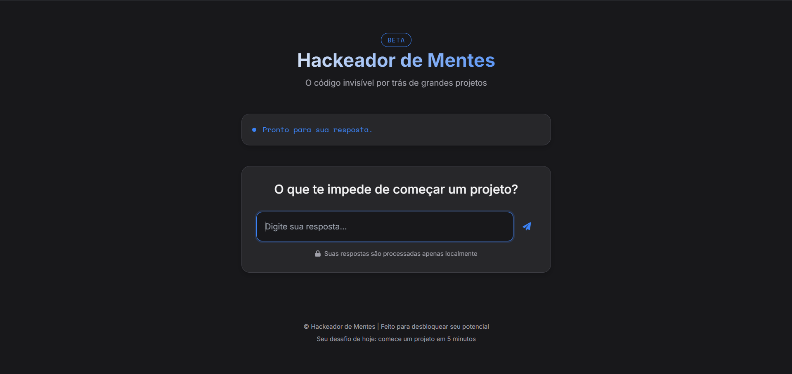

# Hackeador de Mentes 🧠⚡

[](README.md)
[](LICENSE)

**Sua ferramenta anti-procrastinação para desbloquear projetos criativos**

 <!-- Adicione imagem de preview -->

## 🌟 Funcionalidades Principais

- **Análise Cognitiva em Tempo Real**  
  Detecta padrões de pensamento paralisantes usando processamento linguístico

- **Respostas Personalizadas**  
  20+ estratégias específicas para diferentes tipos de bloqueio mental

- **Sistema de Auto-Reflexão**  
  Diálogo guiado para identificação de obstáculos invisíveis

- **Modo Dark/Light**  
  Interface adaptável às preferências do usuário

- **100% Offline**  
  Processamento local sem coleta de dados

## 🛠 Tecnologias Utilizadas

**Frontend**  


**Design**  
- Custom Properties CSS
- Sistema de Cores Dinâmico
- Micro-animações Fluidas
- Tipografia Adaptável (Inter + Space Mono)

## 🤝 Padrões de Contribuição


## 🚀 Como Executar

1. Clone o repositório:
```bash
git clone https://github.com/inojoza28/brain.git
```

2. Acesse o diretório:
```bash
cd brain
```

3. Abra no navegador:
```bash
open index.html  # Ou arraste o arquivo para o navegador
```

## 🧠 Como Usar

1. **Inicie a Reflexão**  
   Responda à pergunta inicial com sinceridade

2. **Receba a Análise**  
   O sistema identificará padrões mentais ocultos

3. **Implemente as Estratégias**  
   Aplicação prática imediata com passos concretos

4. **Reinicie o Ciclo**  
   Nova reflexão para diferentes desafios

## ✉️ Contato

Instagram: [https://instagram.com/dev_inojoza_] 

Hub de Conexões: [https://inojoza28.github.io/conexoes]

---

**Feito com ❤️ por Gabriel Inojoza**  
[](https://github.com/inojoza28)


